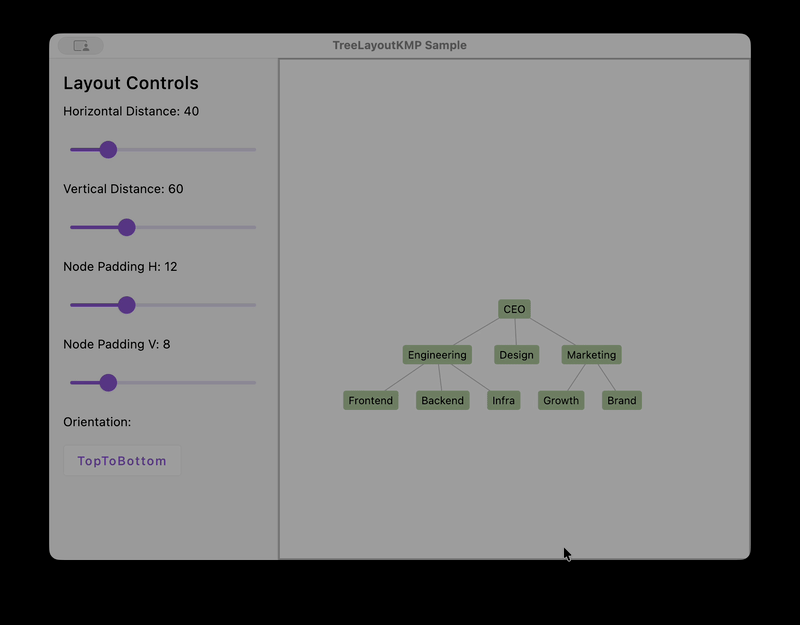
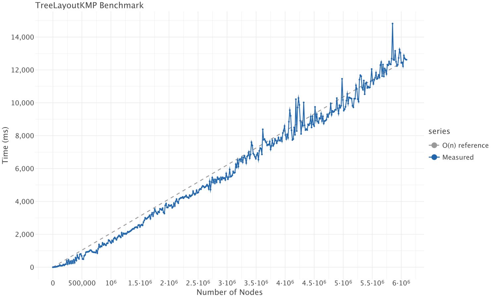

# TreeLayoutKMP

[](https://github.com/linde9821/TreeLayoutKMP/actions/workflows/ci.yml)
[](https://github.com/linde9821/TreeLayoutKMP/actions/workflows/ci.yml)
[](https://central.sonatype.com/artifact/io.github.linde9821/treelayout-kmp)

**[Live Demo](https://linde9821.github.io/TreeLayoutKMP/)** · *
*[API Docs](https://linde9821.github.io/TreeLayoutKMP/api/)**

> ⚠️ **This library is under active development and has not reached a stable release yet.**
> The API may change between versions. Feedback and contributions are welcome.



A pure **Kotlin Multiplatform** library for computing tidy, aesthetically pleasing tree visualizations. It implements
the [Walker algorithm (Buchheim–Jünger–Leipert variant)](https://link.springer.com/chapter/10.1007/3-540-36151-0_32)
in $O(n)$ time with zero platform dependencies — no JVM, Android, or iOS frameworks required.

`TreeLayoutKMP` works with *any* tree structure you already have. You provide a thin adapter describing how to traverse
your nodes; the library computes optimal (x, y) coordinates for every node in the tree.

> **Note:** This library is a *layout engine*, not a rendering library. It outputs coordinates — how you draw the tree
> (Canvas, SVG, Compose, HTML, etc.) is entirely up to you.

## Supported Targets

| JVM | Android | iOS | macOS | tvOS | watchOS | Linux | Windows | JS | Wasm |
|:---:|:-------:|:---:|:-----:|:----:|:-------:|:-----:|:-------:|:--:|:----:|
|  ✅  |    ✅    |  ✅  |   ✅   |  ✅   |    ✅    |   ✅   |    ✅    | ✅  |  ✅   |

## Installation

```kotlin
// build.gradle.kts
dependencies {
    implementation("io.github.linde9821:treelayout-kmp:0.4.0")
}
```

## Quickstart

### 1. Implement `TreeAdapter<T>`

The library is decoupled from any specific tree representation through the `TreeAdapter<T>` interface. This design means
you never need to convert your domain model into a library-specific node class — you simply describe how to navigate it.

```kotlin
import io.github.linde9821.treelayout.TreeAdapter

// Your existing domain model — no modifications needed.
data class OrgNode(
    val name: String,
    val reports: List<OrgNode> = emptyList(),
    val manager: OrgNode? = null,
)

// Adapter bridges your model to the layout engine.
class OrgTreeAdapter(private val rootNode: OrgNode) : TreeAdapter<OrgNode> {
    override fun root(): OrgNode = rootNode
    override fun children(node: OrgNode): List<OrgNode> = node.reports
    override fun parent(node: OrgNode): OrgNode? = node.manager
}
```

> **Why an adapter pattern?**  
> Tree structures vary wildly across domains — file systems, ASTs, org charts, UI component trees. Rather than forcing
> you to wrap every node in a library class, `TreeAdapter<T>` lets the layout engine traverse your data in-place. This
> keeps allocations minimal and avoids coupling your domain layer to a visualization concern.

### 2. Run the Layout

```kotlin
import io.github.linde9821.treelayout.walker.WalkerTreeLayout
import io.github.linde9821.treelayout.walker.WalkerLayoutConfiguration

// Build your tree
val ceo = OrgNode(
    "CEO", reports = listOf(
        OrgNode(
            "VP Engineering", reports = listOf(
                OrgNode("Team Lead A"),
                OrgNode("Team Lead B"),
            )
        ),
        OrgNode("VP Design"),
    )
)

// Configure spacing (optional — defaults to 1.0 for both axes)
val config = WalkerLayoutConfiguration(
    horizontalDistance = 2.0f,
    verticalDistance = 1.5f,
)

// Compute the layout
val adapter = OrgTreeAdapter(ceo)
val result = WalkerTreeLayout(adapter, config).layout()
```

### 3. Read the Results

`TreeLayoutResult<T>` gives you access to computed coordinates:

```kotlin
// Get a single node's position
val ceoPos = result.getPosition(ceo)
println("CEO is at (${ceoPos.x}, ${ceoPos.y})")

// Iterate all positions — useful for rendering
result.getPositions().forEach { (node, point) ->
    println("${node.name} -> (${point.x}, ${point.y})")
}

// Query layout metadata
println("Tree depth: ${result.getMaxDepth()}")
```

Coordinates use a top-down orientation: the root is at `y = 0`, and depth increases downward by `verticalDistance` per
level.

### 4. Variable Node Sizes

By default, nodes are treated as dimensionless points. For real-world trees where nodes have varying widths and heights
(labels, icons, content boxes), provide a `NodeExtentProvider<T>` to prevent overlap:

```kotlin
import io.github.linde9821.treelayout.NodeExtentProvider

class OrgExtentProvider : NodeExtentProvider<OrgNode> {
    override fun width(node: OrgNode): Float = node.name.length * 10f
    override fun height(node: OrgNode): Float = 40f
}

val result = WalkerTreeLayout(
    adapter = OrgTreeAdapter(ceo),
    configuration = WalkerLayoutConfiguration(horizontalDistance = 20f, verticalDistance = 60f),
    nodeExtentProvider = OrgExtentProvider(),
).layout()
```

The layout engine uses node extents to compute center-to-center distances:

- **Horizontal**: `width(left)/2 + horizontalDistance + width(right)/2`
- **Vertical**: each level's y-offset accounts for the tallest node at the preceding level

### 5. Layout Orientation

By default, the tree grows top-to-bottom. Use the `orientation` property to change direction:

```kotlin
val config = WalkerLayoutConfiguration(
    horizontalDistance = 2.0f,
    verticalDistance = 1.5f,
    orientation = Orientation.LeftToRight, // tree grows left → right
)

val result = WalkerTreeLayout(adapter, config).layout()
```

Available orientations: `TopToBottom`, `BottomToTop`, `LeftToRight`, `RightToLeft`.

## Radial Layouts

In addition to the linear Walker layout, the library includes two **radial layout algorithms** that arrange nodes in
concentric circles around the root. These are useful when you want a compact, center-outward visualization — common for
org charts, file explorers, and dependency graphs.

### Radial Walker Layout

**Package:** `io.github.linde9821.treelayout.radial.walker`

This algorithm runs the Walker algorithm internally to determine sibling ordering and spacing, then maps the across-axis
(horizontal positions) to angular positions on concentric rings. Each depth level becomes a ring at radius
`depth × layerDistance`.

```kotlin
import io.github.linde9821.treelayout.radial.walker.RadialWalkerTreeLayout
import io.github.linde9821.treelayout.radial.walker.RadialWalkerLayoutConfiguration

val config = RadialWalkerLayoutConfiguration(
    layerDistance = 80f,
    margin = 0.5f,    // radians subtracted from full circle to create a gap
    rotation = 0.0f,  // angular offset in radians
)

val result = RadialWalkerTreeLayout(
    adapter = OrgTreeAdapter(ceo),
    configuration = config,
).layout()

result.getPositions().forEach { (node, point) ->
    println("${node.name} -> (${point.x}, ${point.y})")
}
```

The constructor accepts an optional `nodeExtentProvider` parameter, which is forwarded to the internal Walker pass for
variable-width node spacing:

```kotlin
val result = RadialWalkerTreeLayout(
    adapter = OrgTreeAdapter(ceo),
    configuration = config,
    nodeExtentProvider = OrgExtentProvider(),
).layout()
```

### Direct Angular Placement Layout

**Package:** `io.github.linde9821.treelayout.radial.angular`

This algorithm recursively partitions angular space among children proportional to their **subtree weight** (total
number
of descendants including the child itself). It runs in **O(n)** — one pass to compute weights, one pass to assign
positions. This produces evenly distributed layouts where larger subtrees receive proportionally more angular space.

```kotlin
import io.github.linde9821.treelayout.radial.angular.DirectAngularPlacementLayout
import io.github.linde9821.treelayout.radial.angular.DirectAngularPlacementConfiguration

val config = DirectAngularPlacementConfiguration(
    layerDistance = 80f,
    rotation = 0.0f,  // angular offset in radians
)

val result = DirectAngularPlacementLayout(
    adapter = OrgTreeAdapter(ceo),
    configuration = config,
).layout()

result.getPositions().forEach { (node, point) ->
    println("${node.name} -> (${point.x}, ${point.y})")
}
```

> **When to choose which?**  
> Use **Radial Walker** when you want the Walker algorithm's aesthetic guarantees (symmetry, minimal width) projected
> onto a circle. Use **Direct Angular Placement** when you want a simpler, weight-proportional distribution with no
> dependency on the Walker pass.

## API Reference

### `TreeAdapter<T>`

| Method                       | Description                                 |
|------------------------------|---------------------------------------------|
| `root(): T`                  | Returns the root node of the tree.          |
| `children(node: T): List<T>` | Returns children in left-to-right order.    |
| `parent(node: T): T?`        | Returns the parent, or `null` for the root. |
| `isLeaf(node: T): Boolean`   | Returns `true` if the node has no children. |

### `WalkerLayoutConfiguration`

| Property             | Type          | Default                   | Description                            |
|----------------------|---------------|---------------------------|----------------------------------------|
| `horizontalDistance` | `Float`       | `1.0f`                    | Minimum spacing between sibling nodes. |
| `verticalDistance`   | `Float`       | `1.0f`                    | Spacing between depth levels.          |
| `orientation`        | `Orientation` | `Orientation.TopToBottom` | Direction the tree grows from root.    |

### `Orientation`

| Value         | Description                          |
|---------------|--------------------------------------|
| `TopToBottom` | Root at top, leaves grow downward.   |
| `BottomToTop` | Root at bottom, leaves grow upward.  |
| `LeftToRight` | Root at left, leaves grow rightward. |
| `RightToLeft` | Root at right, leaves grow leftward. |

### `NodeExtentProvider<T>`

| Method                   | Description                   |
|--------------------------|-------------------------------|
| `width(node: T): Float`  | Returns the width of a node.  |
| `height(node: T): Float` | Returns the height of a node. |

### `WalkerTreeLayout<T>`

| Method                          | Description                                          |
|---------------------------------|------------------------------------------------------|
| `layout(): TreeLayoutResult<T>` | Executes the algorithm and returns positioned nodes. |

Constructor accepts an optional `nodeExtentProvider` parameter. When omitted, nodes are treated as dimensionless points
(backward compatible).

### `RadialWalkerLayoutConfiguration`

| Property        | Type    | Default | Description                                                  |
|-----------------|---------|---------|--------------------------------------------------------------|
| `layerDistance` | `Float` | `1.0f`  | Radial distance between concentric depth rings.              |
| `margin`        | `Float` | `0.0f`  | Angular margin (in radians) subtracted from the full circle. |
| `rotation`      | `Float` | `0.0f`  | Angular offset (in radians) applied to all node positions.   |

### `RadialWalkerTreeLayout<T>`

| Method                          | Description                                          |
|---------------------------------|------------------------------------------------------|
| `layout(): TreeLayoutResult<T>` | Executes the algorithm and returns positioned nodes. |

Constructor parameters: `adapter: TreeAdapter<T>`, `configuration: RadialWalkerLayoutConfiguration`,
`nodeExtentProvider: NodeExtentProvider<T>` (optional, defaults to dimensionless points).

### `DirectAngularPlacementConfiguration`

| Property        | Type    | Default | Description                                                |
|-----------------|---------|---------|------------------------------------------------------------|
| `layerDistance` | `Float` | `1.0f`  | Radial distance between concentric depth rings.            |
| `rotation`      | `Float` | `0.0f`  | Angular offset (in radians) applied to all node positions. |

### `DirectAngularPlacementLayout<T>`

| Method                          | Description                                          |
|---------------------------------|------------------------------------------------------|
| `layout(): TreeLayoutResult<T>` | Executes the algorithm and returns positioned nodes. |

Constructor parameters: `adapter: TreeAdapter<T>`, `configuration: DirectAngularPlacementConfiguration`.

### `TreeLayoutResult<T>`

| Method                          | Description                                     |
|---------------------------------|-------------------------------------------------|
| `getPosition(node: T): Point`   | Returns the `(x, y)` coordinate for a node.     |
| `getPositions(): Map<T, Point>` | Returns all node-to-coordinate mappings.        |
| `getMaxDepth(): Int`            | Returns the maximum depth of the laid-out tree. |

### `Point`

| Property | Type    | Description                                     |
|----------|---------|-------------------------------------------------|
| `x`      | `Float` | Horizontal position.                            |
| `y`      | `Float` | Vertical position (depth × `verticalDistance`). |

## Algorithm

The layout is computed using the Buchheim–Jünger–Leipert improvement of the Walker algorithm, which guarantees:

- **O(n) time complexity** — linear in the number of nodes.
- **Aesthetic rules** — nodes at the same depth are aligned, subtrees are non-overlapping, and the drawing is as narrow
  as possible while preserving symmetry.
- **Deterministic output** — the same tree always produces the same coordinates.

## Benchmark

The `benchmark/` module measures layout computation time across trees ranging from 1 to ~6 million nodes. Results
confirm the algorithm's **O(n) linear time complexity** — computation time scales proportionally with node count.



Run the benchmark yourself:

```bash
./gradlew :benchmark:jvmRun
```

## Running the Samples

The `sample/` module is a Compose Multiplatform application that visualizes a **prefix tree** built from user-provided
words. It features a dark-themed UI with a **layout type selector** (Walker / RadialWalker / DirectAngular) and
context-sensitive controls for each algorithm — orientation for Walker, margin and rotation for radial layouts. It
demonstrates variable node sizes and interactive layout controls.

### Desktop (JVM)

```bash
./gradlew :sample:run
```

Opens a window with a side panel for layout controls, a text input for words, and a zoomable tree canvas.

### Web (wasmJs)

```bash
./gradlew :sample:wasmJsBrowserProductionRun
```

Launches a local dev server and opens the sample in your browser. This is the same app deployed to GitHub Pages.

### Android

The standalone Android sample lives in `sample/android/`. Open it in Android Studio and run on a device or emulator, or
build from the command line:

```bash
cd sample/android
./gradlew installDebug
```

### iOS

Open `sample/iosApp/iosApp.xcodeproj` in Xcode and run on a simulator or device. The shared Kotlin code is compiled
into a static framework via the `:sample` module's iOS targets.

## License

Apache License 2.0 — see [LICENSE](LICENSE) for details.
